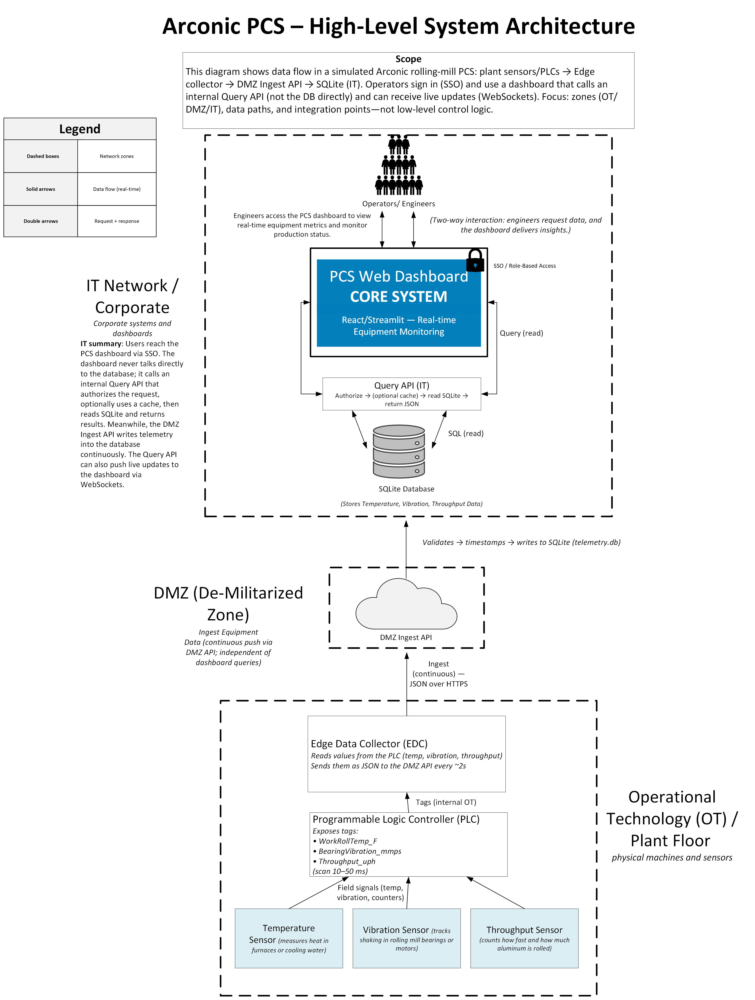

# 🏭 Rolling Mill PCS Telemetry & Quality Dashboard

**PCS-inspired simulation of Arconic’s rolling mill operations** — a full-stack project showcasing **real-time telemetry monitoring**, **anomaly detection**, **defect logging**, and **shift-based reporting**.

> ⚠️ **Disclaimer**  
> All telemetry, reports, and defect data are **simulated** using realistic mock patterns.  
> **No proprietary Arconic data or internal system names are used.**

---

## 🌐 Live Demo
Try the app here: [**Jenny’s Arconic PCS Telemetry Dashboard**](https://jennys-arconic-pcs-telemetry-dashboard.streamlit.app/)

___

## 📌 Overview

This project models a **Process Control Systems (PCS)** environment similar to **Arconic Davenport Works**, home of the **world’s largest aluminum rolling mill**.  
It simulates **machine telemetry** from rolling mills, ingests data through a backend API, stores it in a time-series database, and visualizes trends on a **Splunk-style React dashboard**.

PCS engineers use tools like this daily to:
- Monitor **roller temperatures**, **vibration amplitudes**, and **production throughput**
- Detect **anomalies** in real time
- Track **defects and scrap rates** per batch
- Automate **shift-based reports** and database **backups**

This project **demonstrates domain knowledge** in PCS workflows while remaining **legally safe**.

---

## 🚀 Features

### **Real-Time Telemetry Monitoring**
- Simulates rolling mill PLC sensors generating:
  - Roller temperatures 🌡️
  - Bearing vibration amplitudes ⚡
  - Throughput rates 📦
  - Surface defect percentages 🟢
- Streams telemetry via **WebSockets** for low-latency updates.

### **Anomaly Detection & Alerts**
- Flags issues when thresholds are exceeded:
  - Overheating
  - Excessive vibration
  - Throughput drops
  - Defect surges

### **Defect Logs**
- Tracks defective batches with machine, defect type, and severity.
- Highlights batches flagged for **quality review**.

### **Shift-Based Reports**
- Summarizes:
  - Operator uptime
  - Throughput per shift
  - Scrap rates
- Generates **PDF/Excel reports** using automated scripts.s
---

## 🛠️ Tech Stack

| **Layer**            | **Technology**        | **Why We Use It** |
|----------------------|----------------------|--------------------|
| **PLC Simulation**   | **C**                | Mimics PLC-driven sensors on Arconic rolling mills. |
| **Backend API**      | **Node.js + Express** | Ingests telemetry, flags anomalies, exposes REST APIs. |
| **Database**         | **SQL Server / SQLite** | Stores historical telemetry, defects, alerts, and shift reports. |
| **Frontend Dashboard** | **React + Chart.js/D3.js** | Splunk-style dashboards for real-time anomaly visualization. |
| **Automation**       | **PowerShell**       | Automates backups, report generation, and archival. |
| **Visualization**    | **Splunk-style Dashboards** | Mirrors industry-standard PCS monitoring tools. |
| **Documentation**    | **Microsoft Visio**  | High-level PCS architecture and data flow diagrams. |

---

## 📊 Example Telemetry Data

### **Machine Telemetry (per second)**
| Field            | Example         | Description                |
|------------------|-----------------|----------------------------|
| `machine_id`     | RM-01          | Rolling mill machine ID    |
| `timestamp`      | 2025-08-27 14:32 | Time of reading           |
| `roll_temp`      | 450 °C         | Roller temperature         |
| `vibration`      | 2.3 mm/s       | Bearing vibration amplitude|
| `throughput`     | 315 sheets/hr  | Output rate               |
| `surface_defects`| 1.6%           | Defective sheets (%)       |

### **Defect Log Example**
| Batch ID   | Machine | Defect Type      | Rate (%) | Flagged |
|-----------|--------|------------------|----------|---------|
| B2025-201 | RM-02  | Surface Scratch  | 3.5%     | ✅ Yes  |
| B2025-202 | RM-01  | Thickness Error  | 0.8%     | ❌ No   |

---

## System Overview



---

## 📂 Project Structure

```
arconic-pcs-telemetry-dashboard/
├── backend/             # Node.js backend (API + telemetry ingestion)
├── frontend/            # React + Material UI dashboard
├── scripts/             # PowerShell automation (backups + reports)
├── assets/              # Architecture diagram + screenshots
├── .gitignore           # Optimized for React, Node, Python, PowerShell
├── LICENSE              # MIT License
└── README.md            # Project documentation
```

---

## 🏗️ Installation & Setup

### **1. Clone the Repo**
```bash
git clone https://github.com/<your-username>/arconic-pcs-telemetry-dashboard.git
cd arconic-pcs-telemetry-dashboard
```

### **2. Setup Frontend**
```bash
cd frontend
npm install
npm run dev
```

### **3. Setup Backend**
```bash
cd backend
npm install
npm start
```

### **4. Generate Mock Telemetry**
```bash
cd backend
python data-generator.py
```

---

## 📌 Future Enhancements
- [ ] Integrate live **mock telemetry streaming** into dashboard.
- [ ] Add **predictive maintenance** analytics.
- [ ] Build **operator role-based login system**.
- [ ] Deploy app to **Vercel** for recruiters to explore online.

---

## 📜 License
This project is licensed under the [MIT License](./LICENSE).

---

## 💡 Why This Project Matters
This project is designed to **mirror real PCS workflows** at Arconic:
- Demonstrates **domain expertise** in process control systems.
- Uses realistic **rolling mill telemetry** to simulate real-world conditions.
- Combines **data ingestion, anomaly detection, visualization, and automation** into one app.
- Shows that you can **design, build, and document** PCS systems end-to-end.

---

## 🏭 About Arconic Relevance
Arconic’s Davenport Works houses the **world’s largest aluminum rolling mill**.  
This project directly simulates **the telemetry, dashboards, and workflows PCS engineers manage daily**.
